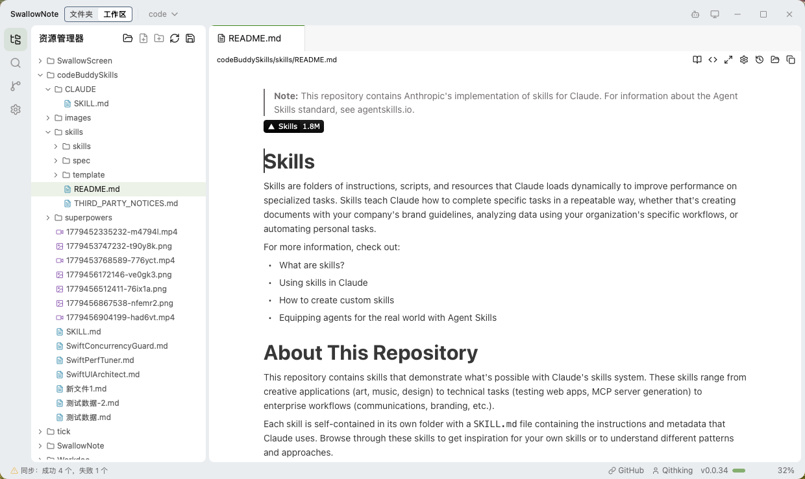
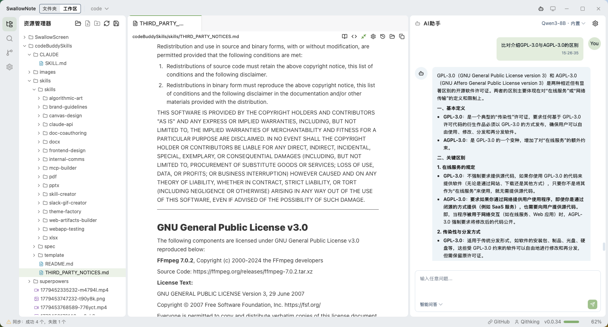

# SwallowNote

<p align="center">
  <strong>一款基于 Tauri 2.x、React 和 BlockNote 构建的强大跨平台 Markdown 编辑器</strong>
</p>

<p align="center">
  中文 | <a href="README.md">English</a>
</p>

<p align="center">
  <a href="#功能特性">功能特性</a> •
  <a href="#快速开始">快速开始</a> •
  <a href="#界面截图">界面截图</a> •
  <a href="#下载安装">下载安装</a> •
  <a href="#参与贡献">参与贡献</a> •
  <a href="#开源许可">开源许可</a>
</p>

---

## 徽章

[](https://github.com/Qithking/SwallowNote/actions)
[](https://github.com/Qithking/SwallowNote/releases)
[](LICENSE)
[]()

---

## 功能特性

- 📝 **所见即所得 Markdown 编辑器** - 基于 BlockNote 的富文本编辑体验（WYSIWYG）
- 💻 **代码高亮** - 基于 CodeMirror 6 的全功能代码编辑器，支持 15+ 种编程语言语法高亮
- 🌲 **文件浏览器** - 支持工作区管理的文件浏览与管理系统
- 📑 **多标签页编辑** - 同时打开和编辑多个文件，支持标签页管理
- 🔍 **快速搜索** - 使用 `Ctrl+P` 命令面板快速查找文件
- 🔎 **全局搜索** - 使用 `Ctrl+Shift+F` 跨文件搜索内容
- 🤖 **AI 助手** - 集成 AI 驱动的写作辅助功能
- 🧠 **思维导图** - 支持可视化思维导图用于头脑风暴
- 🌙 **主题系统** - 支持亮色、暗色和跟随系统主题，使用 CSS 变量定制
- 🌐 **国际化** - 支持英语和简体中文界面
- 📁 **历史记录** - 基于 SQLite 的文件夹访问历史追踪
- 🔧 **Git 集成** - 内置 Git 版本控制支持
- ⌨️ **快捷键支持** - 为高级用户提供的全面键盘快捷键

## 界面截图

<p align="center">
  
</p>

<p align="center">
  
</p>

## 快速开始

### 环境要求

- **Node.js** >= 18.0.0
- **Rust** >= 1.70.0（Tauri 需要）
- **Tauri CLI** >= 2.0.0

### 安装步骤

```bash
# 克隆仓库
git clone https://github.com/Qithking/SwallowNote.git

# 进入项目目录
cd SwallowNote

# 安装 Node.js 依赖
npm install

# 启动开发服务器
npm run tauri dev

# 构建生产版本
npm run tauri build
```

### 开发脚本

| 命令 | 说明 |
|------|------|
| `npm run dev` | 启动 Vite 开发服务器 |
| `npm run build` | 构建前端生产版本 |
| `npm run preview` | 预览生产构建 |
| `npm run tauri dev` | 以开发模式运行应用 |
| `npm run tauri build` | 构建生产版本应用 |
| `npm run lint` | 运行 ESLint 检查 |

### 键盘快捷键

| 快捷键 | 功能 |
|--------|------|
| `Ctrl+P` / `Cmd+P` | 打开命令面板 |
| `Ctrl+Shift+F` / `Cmd+Shift+F` | 全局搜索 |
| `Ctrl+B` / `Cmd+B` | 切换侧边栏显示 |
| `Ctrl+W` / `Cmd+W` | 关闭当前标签页 |
| `Ctrl+Tab` / `Ctrl+Option+Right` | 下一个标签页 |
| `Ctrl+Shift+Tab` / `Ctrl+Option+Left` | 上一个标签页 |
| `Ctrl+1-9` / `Cmd+1-9` | 切换到第 1-9 个标签页 |
| `Ctrl+,` / `Cmd+,` | 打开设置 |
| `Escape` | 关闭弹窗/对话框 |
| `Ctrl+S` / `Cmd+S` | 保存文件 |

## 下载安装

### 最新版本

从 [GitHub Releases](https://github.com/Qithking/SwallowNote/releases/latest) 下载最新的稳定版本：

| 平台 | 安装包格式 | 系统要求 |
|------|-----------|----------|
| 🍎 macOS | DMG（通用二进制） | macOS 13.0+ (Ventura) 及以上 |
| 🪟 Windows | MSI 安装包 | Windows 10+ (64位) 及以上 |
| 🐧 Linux | AppImage / DEB / RPM | Ubuntu 20.04+ / Fedora 34+ 及以上 |

### 历史版本

📦 [查看所有版本](https://github.com/Qithking/SwallowNote/releases)

## 技术栈

### 前端技术

| 技术 | 版本 | 用途 |
|------|------|------|
| [React](https://react.dev/) | ^19.x | UI 框架 |
| [TypeScript](https://www.typescriptlang.org/) | ^5.x | 类型安全 |
| [Vite](https://vitejs.dev/) | ^5.x | 构建工具 |
| [Tauri](https://tauri.app/) | ^2.x | 桌面应用框架 |
| [BlockNote](https://blocknote.dev/) | ^0.51.x | 所见即所得编辑器 |
| [CodeMirror](https://codemirror.net/) | ^6.x | 代码编辑器 |
| [Tailwind CSS](https://tailwindcss.com/) | ^4.x | 样式框架 |
| [Zustand](https://zustand-demo.pmnd.rs/) | ^5.x | 状态管理 |
| [Radix UI](https://www.radix-ui.com/) | 最新版 | 无障碍组件库 |
| [shadcn/ui](https://ui.shadcn.com/) | 最新版 | UI 组件库 |
| [Lucide](https://lucide.dev/) | 最新版 | 图标库 |
| [i18next](https://www.i18next.com/) | ^23.x | 国际化方案 |

### 后端技术（Rust）

| 技术 | 用途 |
|------|------|
| Tauri 2.x | 桌面 API 与窗口管理 |
| SQLite（通过 rusqlite） | 数据持久化存储 |
| Git（通过 git2） | 版本控制集成 |
| 文件监控（notify crate） | 实时文件变化监听 |

## 项目结构

```
swallownote/
├── .github/
│   └── workflows/          # GitHub Actions CI/CD 配置
├── src/                     # React 前端源代码
│   ├── components/          # UI 组件
│   │   ├── AI/             # AI 助手相关组件
│   │   ├── DiffViewer/      # 差异对比组件
│   │   ├── Directory/       # 目录浏览组件
│   │   ├── EditorSettings/  # 编辑器设置面板
│   │   ├── FileTree/        # 文件树组件
│   │   ├── Git/             # Git 集成界面
│   │   ├── History/         # 历史记录面板
│   │   ├── Search/          # 搜索相关组件
│   │   ├── Settings/        # 应用设置面板
│   │   ├── editors/         # 编辑器（BlockNote & CodeMirror）
│   │   └── ui/              # 基础 UI 组件（shadcn/ui）
│   ├── hooks/               # 自定义 React Hooks
│   ├── i18n/                # 国际化翻译文件（en, zh-CN）
│   ├── lib/                 # 工具函数与 Tauri 封装
│   ├── stores/              # Zustand 状态管理
│   ├── types/               # TypeScript 类型定义
│   └── utils/               # 工具函数库
├── src-tauri/               # Rust 后端源代码
│   ├── src/
│   │   ├── ai_proxy/       # AI 代理服务
│   │   ├── commands/       # Tauri 命令处理器
│   │   ├── db/             # 数据库层
│   │   ├── plugins/        # Tauri 插件
│   │   └── services/       # 业务逻辑服务
│   ├── capabilities/       # Tauri 权限配置
│   ├── gen/schemas/        # 自动生成的 Schema
│   └── tauri.conf.json     # Tauri 配置文件
├── assets/                  # 静态资源文件
├── capabilities/            # Tauri 能力配置
├── public/                  # 公共资源目录
├── package.json            # Node.js 依赖配置
├── tsconfig.json           # TypeScript 配置
├── vite.config.ts          # Vite 配置
└── README.md              # 英文说明文档
```

## 配置说明

### 主题定制

应用程序使用 CSS 自定义属性进行主题定制。您可以在 `src/index.css` 中修改颜色：

```css
:root {
  /* 亮色主题颜色 */
  --bg-primary: #ffffff;
  --text-primary: #1a1a1a;
  --theme-color: #3b82f6;
}

[data-theme="dark"] {
  /* 暗色主题颜色 */
  --bg-primary: #1a1a1a;
  --text-primary: #e5e5e5;
}
```

### 状态管理架构

应用程序使用 Zustand stores 来管理不同领域的状态：

| Store | 用途 | 主要状态 |
|-------|------|----------|
| `useWorkspaceStore` | 工作区和文件夹管理 | `rootPath`, `workspaceFolders` |
| `useEditorStore` | 编辑器标签页和内容 | `tabs`, `activeTabId`, `viewMode` |
| `useUIStore` | UI 偏好设置 | `theme`, `sidebarOpen`, `noteWidth` |
| `useGitStore` | Git 集成状态 | `repositories`, `syncStatus` |
| `useEditorSettingsStore` | 编辑器配置 | `fontSize`, `lineHeight` 等 |

## 参与贡献

我们欢迎各种形式的贡献！以下是如何参与的方式：

### 报告 Bug

1. 先在 [Issues](https://github.com/Qithking/SwallowNote/issues) 中检查是否已报告相同问题
2. 如果没有，创建新 Issue 并包含：
   - 清晰的标题和描述
   - 复现问题的步骤
   - 期望行为 vs 实际行为
   - 如适用请提供截图
   - 您的环境信息（操作系统、版本号等）

### 功能建议

1. 在 [Issues](https://github.com/Qithking/SwallowNote/issues) 中查看现有的功能请求
2. 创建新的 Issue 并添加 `enhancement` 标签
3. 描述使用场景和建议的解决方案

### 提交 Pull Request

1. Fork 本仓库
2. 创建功能分支：`git checkout -b feature/amazing-feature`
3. 按照代码规范进行修改
4. 在您的平台上充分测试
5. 提交清晰的提交信息：`git commit -m 'Add amazing feature'`
6. 推送到您的 Fork：`git push origin feature/amazing-feature`
7. 创建 Pull Request 并详细描述更改内容

### 开发规范

- 遵循 TypeScript 严格模式
- 使用 ESLint 保证代码质量
- 编写有意义的提交信息
- 必要时更新文档
- 尽可能在多个平台上测试

## 获取帮助

| 资源 | 链接 |
|------|------|
| 📖 项目文档 | [Wiki](https://github.com/Qithking/SwallowNote/wiki) |
| 🐛 问题反馈 | [Issues](https://github.com/Qithking/SwallowNote/issues) |
| 💡 功能建议 | [Discussions](https://github.com/Qithking/SwallowNote/discussions) |
| 💬 社区交流 | [Discussions](https://github.com/Qithking/SwallowNote/discussions) |

## 致谢

- [Tauri 团队](https://tauri.app/) - 出色的桌面应用框架
- [BlockNote 团队](https://blocknote.dev/) - 优秀的块级编辑器
- [Shadcn UI](https://ui.shadcn.com/) - 美观的组件库
- 所有让这个项目变得更好的贡献者和用户

## 开源许可

本项目采用 **GPL-3.0 开源协议** - 详情请参阅 [LICENSE](LICENSE) 文件。

```
Copyright (c) 2024 Qithking

本程序为自由软件：您可依据自由软件基金会发布的 GNU 通用公共许可证条款，
再分发和/或修改该程序（无论是许可证的第 3 版还是（由您选择的）任何后续版本）。
```

---

<div align="center">

**由 [Qithking](https://github.com/Qithking) 用 ❤️ 制作**

如果您觉得这个项目有帮助，请考虑给我们一个 ⭐ Star！

[⬆ 返回顶部](#swallownote)

</div>
